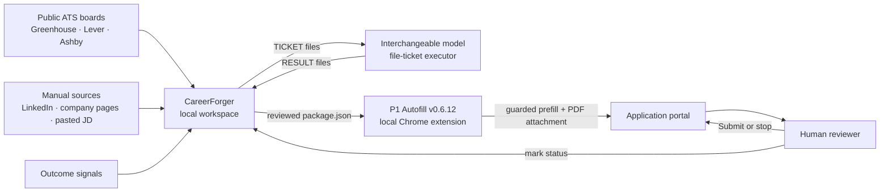
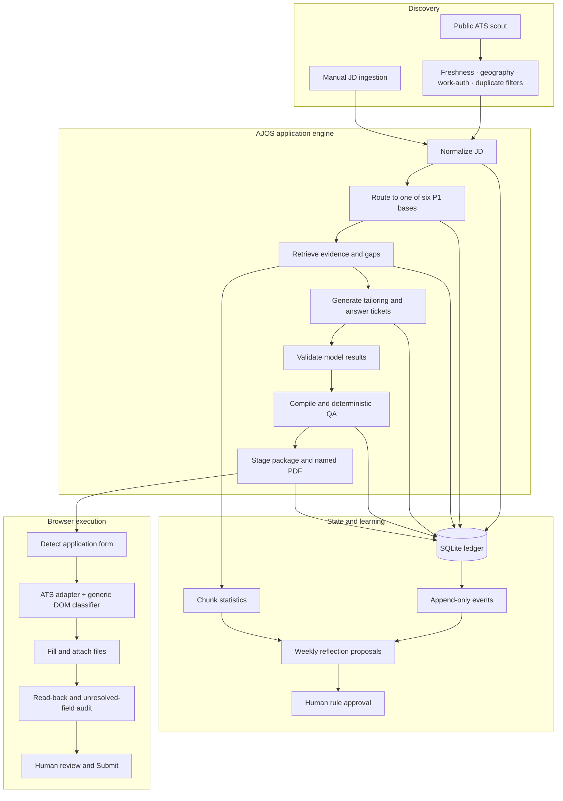
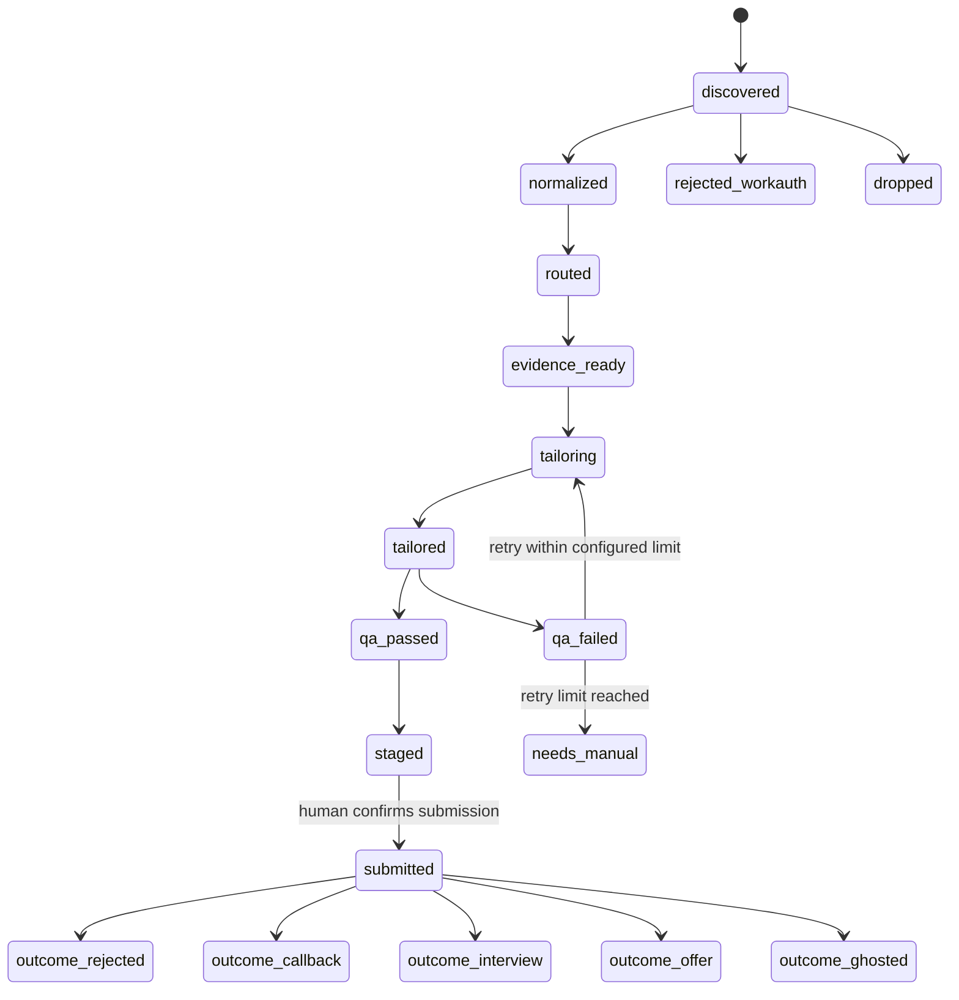
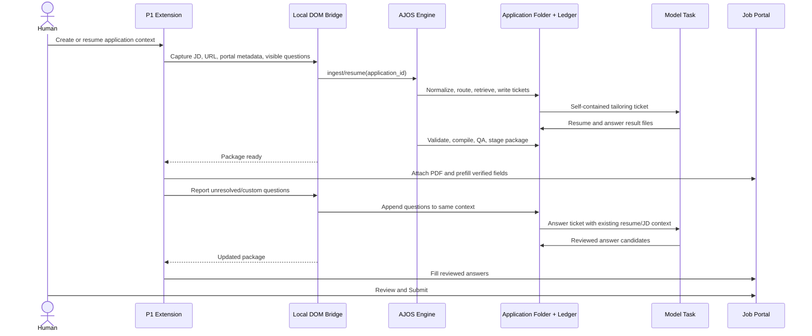

# CareerForger — System Architecture and Technical Report

**Document status:** Current human-readable architecture
**Updated:** 2026-09-19
**Public project name:** CareerForger
**Internal engine and CLI name:** AJOS
**Current autofill release:** P1 Autofill v0.6.12
**Submission model:** Human review and human Submit

## 1. Executive summary

CareerForger is a local-first job-application operating system. It turns a job description into
a truthful, role-specific application package while keeping the final decision and submission
with the human.

The system combines:

- deterministic job discovery and screening;
- routing to one of six resume families;
- evidence retrieval from a curated candidate evidence base;
- model-assisted resume tailoring and custom-answer drafting through portable file tickets;
- deterministic PDF, truthfulness, formatting, and keyword QA;
- package-driven browser autofill through a local Chrome extension;
- a human review and Submit gate;
- append-only outcome tracking and governed learning.

CareerForger is not a mass-application bot. It does not invent experience, bypass portal controls,
accept legal terms, or submit applications. Its purpose is to remove repetitive work while making
each application more consistent, auditable, and truthful.

## 2. Nomenclature

| Name | Meaning | Use |
|---|---|---|
| **CareerForger** | Public name for the complete product and repository | Documentation, GitHub, product discussions |
| **AJOS** | Agentic Job-application Operating System; the internal Python engine and historical CLI name | Commands, state-machine code, existing decision IDs |
| **P1 Autofill** | Local Manifest V3 Chrome extension | Detects supported application forms, fills them from reviewed data, and stops before Submit |
| **P1** | Current role layer | AI PM, PM, TPM/Program, Product Operations, GTM/Growth, Trust & Safety |
| **Application context** | One durable folder and ledger record for one job | Holds the JD, normalized data, evidence, tickets, resume, QA, answers, and package |
| **Ticket** | Model-neutral synthesis request stored as a file | `TICKET_*.md` is executed by any suitable model and produces `RESULT_*` files |
| **Package** | Validated JSON contract consumed by P1 Autofill | Contains canonical profile data, job-specific answers, resume bytes, QA metadata, and `approved:false` |
| **Evidence Pack** | Curated factual authority for resume claims | Prevents unsupported claims and provides traceability |
| **Personal Data Sheet (PDS)** | Canonical authority for recurring application answers | Identity, education, address, work authorization, sponsorship, and voluntary demographic choices |
| **AJOS alignment** | Transparent internal pre-staging score | 70% JD keyword coverage plus 30% deterministic format/truth/location checks; not a commercial ATS score |
| **OPAL estimate** | Advisory role-fit estimate | Context only; never the staging gate |
| **Phase A** | Current operating boundary | CareerForger prepares and pre-fills; the human reviews and submits |
| **DOM bridge** | Planned local connection between a job page and its durable application context | Not built yet |

## 3. Product goals

CareerForger is designed to achieve five outcomes:

1. **Truthful tailoring:** every resume claim must be supported by canonical evidence.
2. **Lower application friction:** repeated identity, eligibility, education, and demographic
   fields should be filled consistently.
3. **Context continuity:** the resume and later custom answers must use the same job-specific
   context rather than disconnected chats.
4. **Deterministic safety:** repeatable software handles state, screening, QA, packaging, and
   filling; a language model is used only where synthesis is genuinely needed.
5. **Human authority:** the candidate reviews all output and remains the only actor who submits,
   accepts legal statements, or sends external messages.

## 4. Non-goals

CareerForger does not currently attempt to:

- submit applications automatically;
- accept arbitration, privacy, certification, or legal acknowledgements;
- scrape login-gated LinkedIn or other credentialed sources;
- bypass CAPTCHAs;
- guess unknown dropdown values;
- fabricate missing experience or metrics;
- operate as a cloud SaaS or store candidate data on a remote backend;
- use a vector database at the current corpus size;
- depend on one model provider or one chat product;
- replace the portal's native state with screenshot-driven browser automation.

## 5. Architectural principles

### 5.1 Deterministic first

If a task can be implemented reliably with ordinary software, it is. Job ingestion, state
transitions, work-authorization screening, routing, evidence retrieval, compilation, QA,
packaging, field classification, value injection, and audit logging do not require model tokens.

### 5.2 Models synthesize; they do not control truth

A model receives a self-contained ticket containing the relevant JD, selected evidence, gaps,
and output contract. It produces a result file. The deterministic pipeline validates that file
before the application can advance.

### 5.3 Files and the ledger are durable context

Chat history is convenient but fragile. CareerForger stores the durable application context in
an application folder and SQLite ledger. A Codex, ChatGPT, Claude, or other compatible model can
resume from the same ticket without becoming the system of record.

### 5.4 Local first and data-minimizing

Candidate data, application artifacts, and resume files remain local. Public ATS APIs are used
only for public job discovery. The Chrome extension runs locally and has no CareerForger backend.

### 5.5 Guarded automation

The system automates preparation and form filling, not judgment or submission. Unknown values,
unsupported portals, cross-origin frames, legal acknowledgements, and ambiguous questions are
surfaced for manual handling.

### 5.6 Learning is governed

Outcome data may influence evidence ranking and generate proposed playbook rules. Proposed rules
remain inert until a human approves them. Learning never silently changes truth or submission
policy.

## 6. System context



## 7. Current logical architecture



## 8. End-to-end application lifecycle

### Stage 1 — Discover or ingest

A job enters through a public ATS scout or a manually supplied JD/URL. The current scout supports
Greenhouse, Lever, and Ashby public endpoints. Login-gated sources are deliberately manual.

Scouting Policy v2 applies:

- seven-day freshness ladder;
- strict newest-first order inside freshness bands;
- US/location checks;
- work-authorization screening;
- repost and ledger duplicate detection;
- broader PM-adjacent matching for P0 priority companies;
- fit used for ranking, never rejection;
- a hard stop for Senior, Staff, Lead, Group PM, and Manager II–IV titles.

The current direct ATS fetch path uses up to 12 worker threads. A compact survivor-only scouting
inbox is planned to reduce unnecessary full-description downloads.

### Stage 2 — Normalize

The raw JD is converted into normalized JSON: company, role, location, apply URL, requirements,
keywords, and work-authorization signals. Work-authorization hard-reject expressions include a
negation guard so phrases such as “without sponsorship” are interpreted correctly.

### Stage 3 — Route

The JD is compared with six validated base resumes using TF-IDF cosine similarity. The highest
relative score selects the starting base. This similarity is a routing signal, not an ATS score.

### Stage 4 — Retrieve evidence

The Evidence Pack is split into stable, hashed chunks with section tags. Retrieval selects
job-relevant evidence using lexical scoring and per-category quotas. The output includes both
selected evidence and explicit gaps. Chunk retrieval and later use are recorded for learning.

### Stage 5 — Create model-neutral tickets

CareerForger creates file tickets for the tasks that need synthesis:

- resume tailoring;
- job-specific custom answers;
- weekly reflection;
- future research dossiers and outreach drafts.

The ticket is self-contained. It quotes the JD and only the evidence needed for the job. The model
must not invent facts to close a gap.

### Stage 6 — Validate and QA

The tailored LaTeX resume is compiled and checked deterministically:

- successful PDF compilation;
- one-page maximum;
- 85–97% page fill;
- forbidden hyperlink patterns;
- banned or unsupported claims;
- keyword coverage;
- location and parse/format checks;
- AJOS alignment of at least 90;
- advisory OPAL estimate recorded separately.

Failures return to tailoring up to the configured retry limit of five. Persistent failure moves
the application to manual review rather than silently weakening the gate.

### Stage 7 — Stage

A successful application produces a review package containing:

- job and application metadata;
- `approved: false`;
- canonical recurring profile data;
- reviewed custom answers;
- the exact resume filename;
- base64-encoded PDF bytes;
- optional cover-letter metadata and bytes;
- transparent resume-QA metadata;
- a human checklist;
- an exported named PDF fallback.

### Stage 8 — Prefill

P1 Autofill detects a likely application page, chooses the ATS adapter, discovers fields across
the normal DOM, open shadow roots, and same-origin frames, classifies each control, resolves its
value from the profile or application package, injects the value, and verifies the committed
state.

### Stage 9 — Human gate

The extension never submits. The human verifies every field, resolves remaining manual questions,
accepts or rejects any legal statements, and chooses whether to Submit.

### Stage 10 — Outcome and reflection

The submission and later result are recorded as legal ledger transitions. Positive outcomes
credit evidence chunks used by the application. Weekly reflection can propose new rules, but the
rules remain inactive until human approval.

## 9. State model



Transitions are enforced in `core/ledger.py`; invalid transitions raise an error. The ledger also
stores append-only events, evidence-chunk statistics, and proposed/approved/rejected playbook
rules.

## 10. Component responsibilities

| Component | Responsibility | Primary inputs | Primary outputs |
|---|---|---|---|
| `ajos.py` | CLI orchestration | Commands and IDs | Deterministic stage execution |
| `core/scout.py` | Public ATS discovery and Policy v2 filtering | Target-company CSV and ATS JSON | Ranked queue and JD files |
| `core/normalize.py` | JD normalization and work-auth screening | Raw JD | Normalized job JSON |
| `core/route.py` | Six-base routing | Normalized JD and base resumes | Ranked TF-IDF scores and selected base |
| `core/retrieve.py` | Evidence selection and gap reporting | JD and Evidence Pack | Selected hashed chunks and gaps |
| `core/taskpack.py` | Model-neutral work contracts | Job, evidence, and application state | `TICKET_*.md` files |
| `core/qa.py` | Compilation and deterministic guardrails | Tailored LaTeX/PDF and JD | QA report and pass/fail decision |
| `core/stage.py` | Browser package creation | Approved results and QA report | `package.json`, checklist, named PDFs |
| `core/ledger.py` | State, events, statistics, and rules | Stage transitions and outcomes | SQLite state plus portable JSON export |
| `core/reflect.py` | Slow learning loop | Events, outcomes, and chunk statistics | Reflection ticket and proposed rules |
| `scripts/build_dashboard.py` | Human operational view | Portable project state | Read-only HTML dashboard |
| P1 `background.js` | Profile seeding/migration and extension messages | Default profile and local storage | Current local profile |
| P1 `content.js` | Form detection, mapping, filling, upload, and validation | DOM, profile, staged package | Prefilled form and transparent progress report |
| P1 `sidebar.css` | UI isolation | Extension panel | Host-resistant icon/panel styling |

## 11. Technical stack

| Layer | Technology | Why it is used |
|---|---|---|
| Runtime | Python 3.12 | Local deterministic engine; modern type syntax; available through Homebrew |
| Python dependencies | Standard library first | Low installation friction and minimal supply-chain surface |
| Persistence | SQLite 3 | Transactional local state, enforced transitions, portable single-file storage |
| Portable data | JSON, Markdown, CSV | Inspectable contracts, tickets, configuration, exports, and queues |
| Resume source | LaTeX | Precise one-page layout, reusable chassis, deterministic compilation |
| PDF compilation | `latexmk`/pdfLaTeX with Tectonic fallback | Reliable local PDF generation |
| PDF inspection | Poppler `pdfinfo` plus XML/byte fallbacks | Page count and layout verification |
| Retrieval/routing | Hand-built TF-IDF and cosine similarity | Transparent, token-free, sufficient for current corpus size |
| Public job access | Python `urllib.request` against Greenhouse, Lever, and Ashby public JSON | No credentials and no browser scraping |
| Concurrency | `concurrent.futures.ThreadPoolExecutor` | Bounded parallel ATS discovery and board verification |
| Browser integration | Chrome Manifest V3 | Local extension execution on application pages |
| Extension implementation | Vanilla JavaScript and CSS | No build chain; direct, auditable DOM behavior |
| Extension state | `chrome.storage.local` plus package-embedded profile | Local recurring profile with package fallback |
| File upload | Browser `File` objects created from package PDF bytes | Attaches the exact QA-approved PDF without portal-native parsing |
| Dashboard | Self-contained HTML generated by Python | Portable, read-only operational visibility |
| Tests | Python `unittest`, source-contract tests, JS syntax checks, JSON validation | Fast local regression coverage without a test framework dependency |
| Version control target | Sanitized GitHub repository | Public code/design without personal or application data |

There is no required application server, cloud database, container platform, Node package tree,
vector database, or model-provider SDK in the current architecture.

## 12. Data stores and contracts

### 12.1 SQLite ledger

Primary tables:

- `applications` — current state and normalized application metadata;
- `events` — append-only transition and decision history;
- `chunk_stats` — evidence retrieval, use, and positive-outcome credit;
- `playbook_rules` — proposed, approved, or rejected learning rules.

`ledger_export.json` is a portable snapshot generated after commands. If the configured cloud
mount cannot lock SQLite, the engine can fall back to a local `~/.ajos/ledger.sqlite`; an explicit
`AJOS_DB` path can override the default.

### 12.2 Application folder

Each application folder is the durable job context. Depending on state, it contains:

```text
raw and normalized JD
retrieved evidence and gap data
TICKET_tailor.md
TICKET_answers.md
RESULT_resume.tex
RESULT_resume.pdf
RESULT_tailor_meta.json
RESULT_answers.md
qa_report.json
package.json
CHECKLIST.md
```

### 12.3 Staged package

The package separates two value classes:

- **canonical recurring values** from the PDS/profile;
- **job-specific values** such as the posting location, tailored answers, resume, and cover letter.

The package includes QA metadata and always sets `approved:false`. This flag documents that staging
is not submission approval.

### 12.4 Evidence authority

The authority order is:

1. Evidence Pack for resume claims and metrics;
2. Personal Data Sheet for recurring application facts;
3. reviewed job-specific result files;
4. normalized JD for employer-provided role facts;
5. historical files only as non-authoritative evidence for later review.

## 13. P1 Autofill architecture

P1 Autofill v0.6.12 is local, deterministic, and structurally separated from submission.

### Detection and discovery

- Uses URL, hostname, resume inputs, application language, and known field signals.
- Waits for delayed single-page application mounts through a bounded `MutationObserver`.
- Traverses the normal document, accessible open shadow roots, and same-origin iframes.
- Does not access closed shadow roots or cross-origin frames.

### Classification

- Resolves human-visible labels before unreliable internal names.
- Combines exact high-risk overrides, autocomplete semantics, ATS selectors, ARIA, placeholders,
  and guarded regular expressions.
- Uses word boundaries to prevent `unit` from matching `opportunity`.
- Uses exact matching for short Yes/No values so `No` cannot match `Latino`.

### ATS adapters

- **Greenhouse:** exact visible-option matching, control-bound trusted clicks, React settlement,
  committed-value verification, location/country/state/race handling.
- **Ashby:** question-level radio groups for demographics, work authorization, sponsorship,
  relocation, onsite/hybrid willingness, and location-related controls.
- **Lever:** explicit radio guards for US residence and future visa sponsorship.
- **Generic fallback:** accessible label and field discovery for ordinary controls.

### Upload

The package contains the exact PDF bytes that passed QA. The extension decodes those bytes,
constructs a browser `File`, assigns it to the mapped resume input, dispatches the expected events,
and verifies the visible filename or attachment state.

### UI

The panel begins as a 44-pixel lightning icon. It expands only when clicked and minimizes back to
the icon so it does not block portal controls. Its logs explain what was filled, verified, or left
for manual attention.

### Safety boundary

P1 has no Submit control and excludes submit targets from trusted click paths. It does not use the
portal's “Autofill from resume” parser because that parser can overwrite canonical fields.

## 14. Current profile semantics

The exact private values live in the PDS and extension profile and must not be copied into a public
repository. Architecturally, the profile supports:

- legal identity and contact information;
- structured address and separate apartment/unit representation;
- education entries;
- work authorization and current/future sponsorship distinctions;
- US residence, relocation, hybrid, and onsite willingness;
- employment and referral answers;
- voluntary demographic answers;
- fields that must never be auto-answered.

Important semantic distinctions are preserved:

- willingness to relocate is not the same as already living in the advertised city;
- no immediate sponsorship during valid work authorization is not the same as no future
  sponsorship requirement;
- race and Hispanic/Latino identity are separate questions;
- ambiguous legal or government questions remain manual.

## 15. Security, privacy, and trust boundaries

| Boundary | Policy |
|---|---|
| Candidate data | Local only; exclude from public GitHub |
| Job discovery | Public ATS endpoints only; no credential or cookie automation |
| Model use | Tickets contain only needed context; results are validated before advancement |
| Resume claims | Must trace to canonical evidence; unsupported gaps stay gaps |
| Browser actions | Exact, allowlisted field/option actions with read-back; no Submit |
| Legal statements | Human only |
| Unknown values | Manual attention; never guess |
| Public repository | Exclude PDS/profile, resumes, application packages, ledgers, browser profiles, generated artifacts, and private references |
| Learning | Proposed rules are inert until human approval |
| Legacy copies | Archived extension builds are historical only and must not overwrite the active release |

## 16. Repository and private runtime layout

The public repository contains candidate-neutral source, tests, synthetic templates, and
public-safe documentation:

```text
CareerForger/
├── README.md
├── SECURITY.md
├── ajos.py
├── config.example.json
├── core/
├── scripts/
├── tests/
├── extension/
│   ├── manifest.json
│   ├── background.js
│   ├── content.js
│   ├── sidebar.css
│   └── profile.default.json
├── examples/
└── docs/
```

A real installation creates a gitignored `config.json`, `extension/profile.local.json`, and a
`private/` runtime tree containing the candidate's Evidence Pack, Personal Data Sheet, resume
bases, LaTeX chassis, application folders, scouting output, and generated artifacts.

## 17. Operational deployment


CareerForger runs directly on macOS:

1. Python 3.12 executes the AJOS CLI.
2. SQLite persists local state.
3. TinyTeX/LaTeX or Tectonic compiles the resume.
4. Poppler checks PDF properties.
5. The generated package is loaded into the unpacked P1 Autofill extension.
6. Chrome displays the application form and the extension fills supported fields.
7. The human reviews and submits.

The public extension source lives in `extension/`. A real installation may load that directory
directly or maintain a private synchronized runtime copy. Candidate values belong in the
untracked `extension/profile.local.json`. After an unpacked extension is reloaded, the application
page must also be refreshed so the current content script is injected.

## 18. Verification and test strategy

The current regression suite has 18 tests covering:

- Scouting Policy v2 freshness and ordering;
- P0 loose title admission;
- fit-ranks-never-filters behavior;
- senior-title exclusion;
- keyword cleanup and AJOS alignment calculation;
- PDF fill estimation and OPAL metadata validation;
- staged package answer and resume-QA contracts;
- extension manifest/UI version agreement;
- identity and eligibility mappings;
- absence of unsafe keyboard option selection;
- exact No handling so it cannot match Latino;
- Lever US-location and future-sponsorship radio guards.

Additional verification includes JavaScript syntax checks, JSON parsing, extension-directory
fingerprint comparison, and live non-submitting portal regressions.

## 19. Observability and auditability

CareerForger favors artifacts that a human can inspect:

- ledger event history;
- portable ledger export;
- normalized JD JSON;
- evidence selections and gap lists;
- ticket and result files;
- QA report with explicit checks;
- staged package with QA metadata;
- human checklist;
- extension progress and unresolved-field log;
- read-only approval dashboard;
- failure-pattern and failure-learning documents.

This makes failures diagnosable without relying on invisible model memory.

## 20. Built, pending, and historical status

| Capability | Status |
|---|---|
| State machine, ledger, events, chunk statistics | Built |
| JD normalization and work-auth screening | Built |
| Six-base TF-IDF routing | Built |
| Evidence retrieval and gap reporting | Built |
| Tailoring, answer, and reflection tickets | Built |
| PDF compilation and deterministic QA | Built |
| Staged package and named PDF export | Built |
| Scouting Policy v2 | Built |
| Read-only approval dashboard | Built |
| P1 Autofill v0.6.12 | Built and actively hardened |
| Greenhouse, Ashby, and Lever guarded mappings | Built |
| DOM-to-application-context bridge | **Not built** |
| Compact survivor-only scouting inbox | Pending |
| Research dossier and outreach tickets | Pending |
| Gmail/Notion outcome synchronization | Pending |
| Autonomous submission | Rejected |
| Vector database at current scale | Rejected/deferred |
| Legacy v0.5.11 extension copy | Historical snapshot only |

## 21. Planned DOM-to-application-context bridge

The bridge is the next major product capability after the sanitized repository boundary. Its
purpose is to replace the manual cycle of copying a JD into a chat, downloading a resume, uploading
it to the portal, copying custom questions back into the same chat, and returning with answers.

### Target experience

1. The user opens a job application page and clicks **Create/Resume CareerForger Application**.
2. The extension captures permitted job-page data and creates or resolves one application ID.
3. A local bridge writes the capture into that application's durable folder.
4. AJOS normalizes, routes, retrieves evidence, and creates the tailoring ticket.
5. One model task works inside that application context and writes the result files.
6. Deterministic QA runs; failures return to the same context.
7. A passing package becomes available to P1 Autofill.
8. P1 attaches the exact resume and fills recurring fields.
9. Newly discovered custom questions are appended to the same application context.
10. The model drafts answers using the same JD, evidence, and resume context.
11. P1 fills reviewed answers.
12. The human reviews and clicks Submit.

### Target architecture



### Proposed bridge boundaries

- Runs locally and binds only to the local machine.
- Uses explicit versioned JSON schemas between the extension and bridge.
- Keys all operations by ledger application ID.
- Stores durable context in the application folder, not only in a chat transcript.
- Never exposes arbitrary filesystem paths to the webpage.
- Allows only approved commands such as capture, status, package retrieval, and question update.
- Preserves `approved:false` and the human Submit gate.
- Uses manual paste/import when a portal blocks DOM access or requires authentication/CAPTCHA.
- Starts with one human-opened Codex task per application; an automatic task runner is a later,
  separately approved optimization.

### Proposed bridge states

```text
captured -> ingested -> tailoring_needed -> qa_running -> package_ready
         -> questions_captured -> answers_needed -> package_updated -> human_review
```

These bridge states should reference, not replace, the existing application state machine.

## 22. GitHub publication architecture

This repository uses a sanitized publication boundary: code, tests, generic schemas, synthetic
fixtures, and public-safe documentation are tracked; candidate-specific and application-specific
content remains local and ignored.

Recommended repository boundary:

```text
Include:
  engine source
  extension source
  generic configuration template
  schema examples with synthetic data
  tests and sanitized fixtures
  architecture and operating documentation

Exclude:
  Personal Data Sheet and real extension profile
  Evidence Pack containing private history
  real resumes and application folders
  SQLite ledgers and exports
  browser profiles
  downloaded/generated artifacts
  private Word references
  secrets, cookies, tokens, and local absolute-path configuration
```

The public repository should use `careerforger` as its name. AJOS identifiers may remain in code
where renaming would break compatibility, but documentation should explain the relationship once
and avoid presenting them as two separate products.

## 23. Design trade-offs

### Why SQLite instead of a cloud database?

One candidate, one local machine, transactional state, and a need for auditability make SQLite
simpler and safer. A remote database adds privacy and operational cost without current benefit.

### Why TF-IDF instead of embeddings?

The evidence corpus is small and curated. Lexical retrieval is transparent, deterministic, cheap,
and currently adequate. Embeddings should be introduced only if a golden-set evaluation proves a
meaningful improvement.

### Why file tickets instead of direct model APIs?

File contracts preserve model neutrality, allow human inspection, survive provider changes, and
separate synthesis from deterministic execution.

### Why a Chrome extension instead of general browser automation?

The extension can operate inside the actual application page, preserve the user's authenticated
session, map the live DOM, and remain structurally incapable of submission. General browser
hand-driving previously produced hidden-form, phone-country, and file-upload failures.

### Why base64 PDF bytes in the package?

The extension cannot safely read arbitrary local paths. Embedding the exact QA-approved bytes
lets it construct the correct browser `File` locally and prove that the attached artifact matches
the staged application.

### Why retain a manual fallback?

Portals can use cross-origin frames, closed shadow roots, proprietary controls, CAPTCHAs, or legal
steps that should not be automated. Manual fallback is a deliberate safety feature, not a failure
of the architecture.

## 24. Success measures

CareerForger should be evaluated on:

- percentage of applications reaching QA pass without manual repair;
- percentage of supported fields filled and read-back verified;
- zero incorrect work-authorization, sponsorship, location, or demographic answers;
- zero unsupported resume claims;
- resume QA pass rate and retry count;
- time from JD capture to review-ready package;
- number of manual copy/paste transitions eliminated;
- callback/interview/offer outcomes by evidence chunk and resume family;
- zero automated submissions or unapproved external messages.

## 25. Source-of-truth documents

| Document | Role |
|---|---|
| `docs/ARCHITECTURE.md` | Complete architecture, current boundaries, technology stack, and roadmap |
| `README.md` | Public entry point and setup instructions |
| `docs/AUTOFILL_FAILURE_PATTERNS.md` | Sanitized reusable failure patterns |
| `extension/README.md` | Current extension operating guide |
| `extension/PACKAGE_FORMAT.md` | Browser package contract |
| `SECURITY.md` | Public privacy and disclosure boundary |

When documents conflict, use this authority order:

1. current code and deterministic tests;
2. `docs/ARCHITECTURE.md`;
3. subsystem documentation and schemas;
4. README examples.

## 26. Current next steps

1. Build the local DOM-to-application-context bridge with versioned schemas and application-ID
   continuity.
2. Add the compact scouting inbox with survivor-only full-JD retrieval and checkpoints.
3. Add research dossier and outreach draft tickets.
4. Add idempotent Gmail/Notion outcome synchronization.
5. Reconsider orchestration and embeddings only after measured need.

---
|---|
| `STATE.md` | Live build history and single active next step |
| `docs/AJOS_ARCHITECTURE_CANONICAL.md` | Locked decisions and concise built/pending boundary |
| `docs/CAREERFORGER_ARCHITECTURE_REPORT.md` | Human-readable complete architecture and technical report |
| `docs/DOM_AUTOFILL_ARCHITECTURE.md` | Detailed current DOM/autofill design |
| `docs/AUTOFILL_FAILURE_LEARNING.md` | Live failure history and fixes |
| `docs/AUTOFILL_FAILURE_PATTERNS.md` | Sanitized reusable failure patterns |
| `docs/DECISION_CONFLICT_REGISTER.md` | Rejected, superseded, built, and pending claims |
| `PIPELINE_MAP.html` | Visual pipeline map |
| `MIGRATION_REPORT.json` | Relocation, inventory, active/legacy copy status |

When documents conflict, use this authority order:

1. current code and deterministic tests;
2. `STATE.md` active cursor;
3. canonical architecture decisions;
4. this human-readable report;
5. detailed subsystem documents;
6. historical imports and archived chats.

## 26. Current next steps

1. Create the sanitized `careerforger` GitHub repository boundary.
2. Build the local DOM-to-application-context bridge with versioned schemas and application-ID
   continuity.
3. Add the compact scouting inbox with survivor-only full-JD retrieval and checkpoints.
4. Add research dossier and outreach draft tickets.
5. Add idempotent Gmail/Notion outcome synchronization.
6. Reconsider orchestration and embeddings only after measured need.

---

CareerForger's central architectural choice is simple: **automate repeatable work, preserve
truth as data, use models only for bounded synthesis, and keep consequential actions under human
control.**
